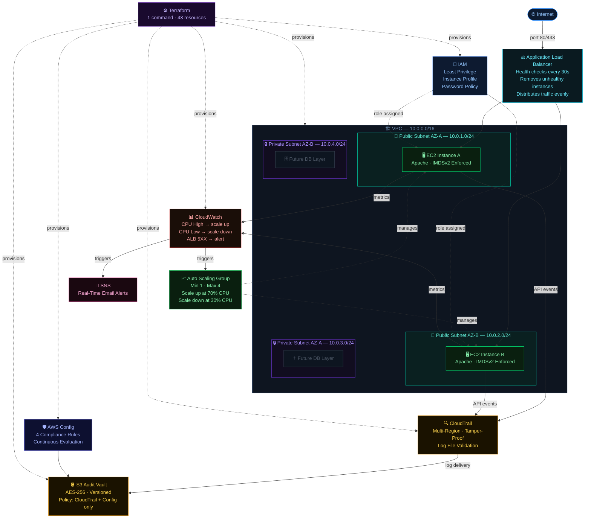

# ⚔️ AWS Zero Trust Security Platform
### Auto-Scaled · Load Balanced · Compliance Ready · Built with Terraform

---

## What makes this different?

This is not just another AWS deployment. This is a full enterprise-grade security platform combining high availability, auto scaling, load balancing, and continuous compliance under one Terraform-automated infrastructure.

Three things set this project apart:

**1. Application Load Balancer** — traffic never hits a server directly. Every request goes through the ALB, which health-checks instances every 30 seconds and only routes to healthy ones. One instance dies, the ALB routes around it. The user never notices.

**2. Auto Scaling Group** — the platform watches its own CPU. When load increases, it adds servers automatically. When load drops, it removes them. No human intervention, no over-provisioning, no downtime.

**3. AWS Config** — most people build secure infrastructure and hope it stays that way. This platform continuously evaluates every resource against compliance rules. The moment something drifts — Config catches it and flags it.

Everything deploys with terraform apply. One command. 43 resources. Done.

---

## 🌐 Live Demo

**👉 http://zero-trust-alb-1441037960.us-east-1.elb.amazonaws.com**

Refresh the page multiple times. You will hit different EC2 instances — that is the ALB distributing traffic across the Auto Scaling Group in real time.

---

## 📌 Platform Overview

| Layer | Service | What it does |
|---|---|---|
| 🔐 Identity | IAM | Least privilege roles, strong password policy, zero hardcoded credentials |
| 🪣 Audit Storage | S3 | AES-256 encrypted, versioned vault — receives logs from CloudTrail and Config |
| 🔍 Logging | CloudTrail | Multi-region trail capturing every API call with tamper-proof validation |
| 🌐 Networking | VPC | 4-subnet isolated network across 2 availability zones |
| ⚖️ Load Balancing | Application Load Balancer | Distributes traffic, health-checks every instance, removes unhealthy ones |
| 📈 Auto Scaling | Auto Scaling Group | Scales 1 to 4 instances based on CPU — fully automatic |
| 📊 Monitoring | CloudWatch + SNS | CPU, scaling, and ALB alarms with real-time email alerts |
| 🛡️ Compliance | AWS Config | 4 continuous compliance rules — evaluated automatically |
| 🖥️ Compute | EC2 | Hardened instances, IMDSv2 enforced, Apache via Launch Template |

---

## 🏗️ Architecture

---

## 🚀 Deployment — Phase by Phase

### Phase 1 — IAM
**Module:** modules/iam/

Identity is the foundation. Before any server, any network, anything — the account-wide access controls were locked down first.

- 14-character minimum password, symbols, numbers, upper and lowercase required
- 90-day expiration, last 5 passwords blocked from reuse
- Dedicated EC2 instance role — CloudWatch and SSM access only
- No wildcard permissions, no admin policies, no credentials stored on instances

---

### Phase 2 — S3 Audit Vault
**Module:** modules/s3/

A single encrypted bucket serves as the central destination for all audit and compliance data — CloudTrail logs and AWS Config records both land here.

- AES-256 encryption at rest
- Versioning enabled — logs are preserved even if deletion is attempted
- Public access blocked at every level
- Bucket policy allows only CloudTrail and AWS Config to write

---

### Phase 3 — CloudTrail
**Module:** modules/cloudtrail/

Every API call in the account is recorded — from the console, the CLI, the SDK, or an attacker. All of it, across all regions.

- Multi-region trail — no blind spots in unused regions
- Global service events — IAM and STS activity captured
- Log file validation — cryptographic proof logs have not been tampered with

---

### Phase 4 — VPC
**Module:** modules/vpc/

The network is built across two availability zones. Four subnets — two public for the web tier, two private reserved for a future database layer.

- ALB security group: accepts 80 and 443 from the internet
- EC2 security group: accepts traffic only from the ALB security group
- Instances are not directly reachable from the internet at all

---

### Phase 5 — Application Load Balancer ⭐
**Module:** modules/alb/

This is what separates a basic deployment from a production-grade one. The ALB is the front door to the entire platform.

Every incoming request hits the ALB first. The ALB checks which instances are healthy, then forwards the request to one of them. Health checks run every 30 seconds. If an instance fails three consecutive checks it is silently removed from rotation. The user never sees an error.

The ALB spans both availability zones. If an entire AZ goes down, traffic automatically shifts to instances in the other zone. That is what high availability actually looks like.

---

### Phase 6 — Auto Scaling Group ⭐
**Module:** modules/asg/

The Auto Scaling Group manages the fleet of EC2 instances and adjusts size based on actual demand. Every instance is launched from a Launch Template — a versioned, immutable blueprint defining the AMI, instance type, IAM role, security group, IMDSv2 enforcement, and user data script. Every instance is identical. No configuration drift, no manual setup.

Scaling policies:
- CPU above 70% for 5 minutes — add one instance
- CPU below 30% for 10 minutes — remove one instance
- Minimum 1 instance always running
- Maximum 4 instances as the cost ceiling

IMDSv2 is enforced on every instance. This blocks Server Side Request Forgery attacks where a compromised application reads AWS credentials from the metadata endpoint. With IMDSv2 that attack returns a 401.

---

### Phase 7 — CloudWatch + SNS
**Module:** modules/cloudwatch/

Three alarms run continuously:

- CPU High — exceeds 70% for 5 minutes — triggers scale-up AND sends email alert
- CPU Low — below 30% for 10 minutes — triggers scale-down to save cost
- ALB 5XX — more than 10 server errors in 5 minutes — catches app failures before outages

---

### Phase 8 — AWS Config ⭐
**Module:** modules/config/

AWS Config is the compliance layer that most cloud deployments skip. This platform does not skip it.

Config continuously evaluates every resource against four rules — not on a schedule, continuously. Every time a resource is created or modified, Config re-evaluates it.

**Rule 1 — S3 bucket public access prohibited**
Any S3 bucket allowing public read access is flagged immediately.

**Rule 2 — EC2 IMDSv2 check**
Every EC2 instance must enforce IMDSv2. Any instance running IMDSv1 is flagged — including ones launched outside Terraform.

**Rule 3 — CloudTrail enabled**
Verifies a multi-region trail is active. If logging is ever disabled — by accident or an attacker — Config raises the flag.

**Rule 4 — Root account MFA enabled**
The root account without MFA is one of the highest-risk configurations in AWS. This rule ensures it is always flagged.

Every evaluation result is recorded to the S3 audit vault — a full compliance history available at any time.

---

## 🛡️ Security Simulation

| Scenario | Result | Caught By |
|---|---|---|
| Unauthorized API Access | Blocked + Alerted | IAM · CloudTrail · CloudWatch · SNS |
| SSH Brute Force | Blocked | Key Pair Auth · EC2 Security Group |
| Log Tampering | Blocked + Preserved | S3 Policy · Versioning · CloudTrail |

📄 [Read the full Security Simulation Report](SECURITY_SIMULATION.md)

---

## 🔐 Key Security Decisions

**IMDSv2 on every instance** — enforced at the Launch Template level. Every instance in the ASG inherits it. No way to launch without it.

**EC2 only reachable via ALB** — EC2 security group allows inbound only from the ALB security group. Direct access is impossible.

**Multi-AZ deployment** — ALB and ASG span two AZs. A single AZ failure does not take down the platform.

**Config over manual audits** — manual audits happen once. AWS Config evaluates continuously. Drift is caught in minutes, not months.

**Versioned Launch Template** — every configuration change creates a new version. Rollbacks are instant.

**S3 as the single audit destination** — CloudTrail and Config both write to the same encrypted vault. One place to look, one place to protect.

---

## 💰 Cost Breakdown

| Service | Monthly Cost |
|---|---|
| EC2 t2.micro x 2 | /usr/bin/bash.00 (free tier) |
| Application Load Balancer | ~6.00 |
| S3 Audit Vault | ~/usr/bin/bash.02 |
| CloudTrail | /usr/bin/bash.00 (first trail free) |
| CloudWatch | /usr/bin/bash.00 (free tier) |
| SNS | /usr/bin/bash.00 (under 1,000 emails) |
| AWS Config | ~/usr/bin/bash.003 per rule evaluation |
| VPC / IGW / Subnets | /usr/bin/bash.00 (always free) |
| **Total** | **~6/month** |

To run at zero cost during development, set ASG desired capacity to 0. The ALB is the only billable component at rest.

---

## 🛠️ Deploy it yourself

Prerequisites: Terraform >= 1.0 · AWS CLI · IAM user with permissions · Ubuntu Linux

---

## 📁 Project Structure

---

## 🔗 Related Projects

| Project | What it covers |
|---|---|
| [AWS CLI Security Framework](https://github.com/johntay379-hub/aws-end-to-end-security-framework) | Security fundamentals deployed manually via CLI |
| [Terraform Security Framework](https://github.com/johntay379-hub/terraform-aws-security-framework) | Same security model rebuilt as Infrastructure as Code |
| **Zero Trust Security Platform** | **Full enterprise architecture — ALB, ASG, AWS Config added** |

---

## 👨‍💻 Author

**John** — AWS Cloud Security Engineer
Built and deployed May 2026 · Region: us-east-1 · Terraform on Ubuntu Linux

> The question I asked before every design decision: what would an attacker do, and what does this platform do about it? Every service here is the answer to that question.
