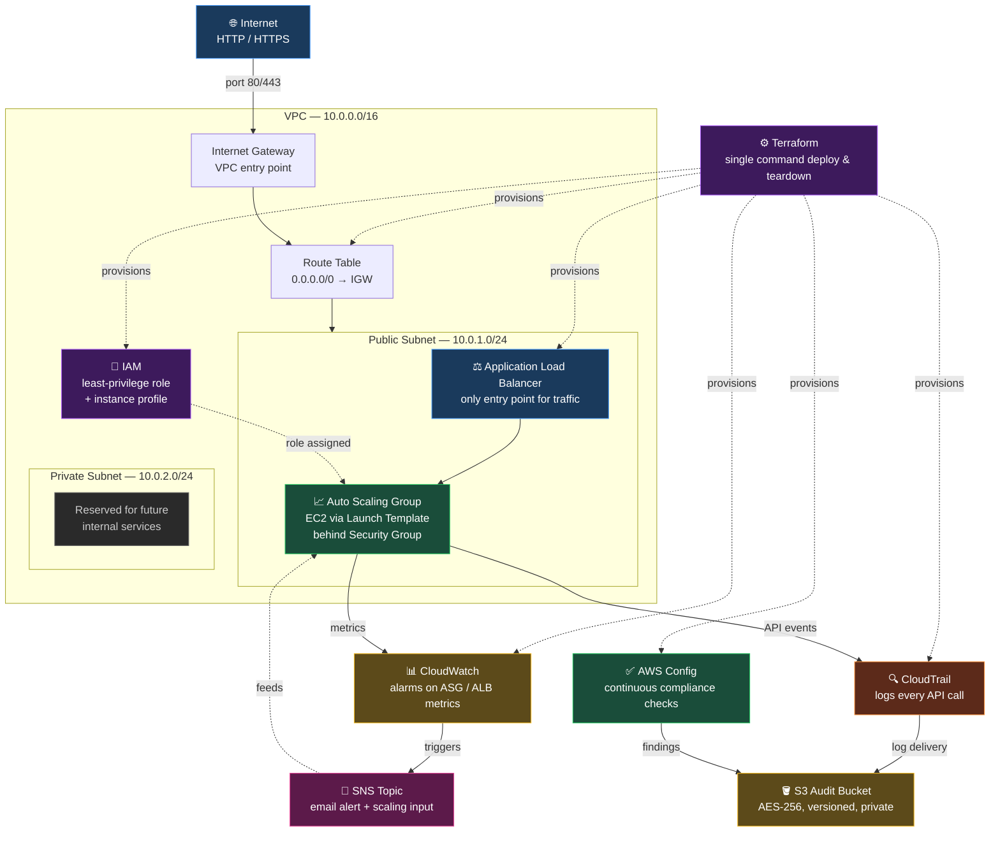

# 🔒 AWS Zero Trust Security Platform


A production-style AWS environment built entirely with Terraform that applies Zero Trust principles end to end — least-privilege identity, network segmentation, encrypted audit logging, automated scaling, real-time alerting, and continuous compliance checking. No manual console clicks. `terraform apply` builds it the same way every time, and `terraform destroy` removes it just as cleanly.

## Live demo

The infrastructure described here was deployed, tested, and screenshotted, then deliberately torn down with `terraform destroy` to avoid ongoing AWS charges while not in active use. There is no live URL right now. Every screenshot in `/screenshots` was taken while the stack was actually running, and the full deployment can be reproduced in a few minutes — see [Deploy it yourself](#deploy-it-yourself) below.

## What this project does

Most personal AWS projects stop at "I launched a server and it works." This one treats security and observability as part of the architecture, not an afterthought:

- Every EC2 instance runs under an IAM role scoped to only the permissions it needs
- Every API call made in the account is recorded by CloudTrail and stored in an encrypted, versioned S3 bucket
- Traffic only reaches compute through a load balancer — instances are never exposed directly to the internet
- The compute fleet scales itself up and down automatically based on real load
- CloudWatch alarms notify a human through SNS and trigger scaling policies without manual intervention
- AWS Config continuously checks the account against compliance rules instead of relying on a one-time audit

## Why Terraform

Clicking through the AWS console to build this by hand would mean repeating dozens of steps in the right order, with no record of what was actually configured and no easy way to tear it down completely afterward. Terraform turns that into a single declarative codebase: the infrastructure is version-controlled, reviewable, repeatable, and destroyable on command. The exact same `terraform apply` that built this stack the first time will rebuild it identically the next time — which matters in an interview setting too, since it means this project can be redeployed live if someone wants to see it run rather than just look at screenshots.

## Architecture



Internet traffic hits an **Application Load Balancer** in the public subnet, which distributes requests across an **Auto Scaling Group**. The ASG launches EC2 instances from a Terraform-managed **launch template** inside the **VPC**, and scales the fleet up or down using an attached **scaling policy** based on load.

Every instance runs under an **IAM role** with an instance profile attached — scoped to the minimum permissions it needs, governed by an account-wide password policy with no admin users or wildcard permissions.

**CloudTrail** records every API call made in the AWS account and delivers the logs to an **S3 bucket** that is encrypted at rest, versioned, and fully blocked from public access — so even an attacker with partial access can't read or permanently delete the audit trail.

**CloudWatch** watches infrastructure metrics continuously. When a threshold is crossed, it does two things at once: publishes to an **SNS topic** so a person gets notified by email, and feeds the scaling policy so the Auto Scaling Group adjusts capacity automatically.

Separately, **AWS Config** continuously evaluates the account against a set of compliance rules — not on a schedule, but as things change — and writes its findings into the same S3 bucket used for CloudTrail logs, so there's one place to check both "what happened" and "are we still compliant."

## How it was built — phase by phase

**Phase 1 — Networking.** The VPC, subnets, route tables, internet gateway, and security groups were defined first, establishing the network boundary everything else sits inside.

**Phase 2 — Identity.** IAM roles, an instance profile, and an account-wide password policy were created before any compute existed, so that when EC2 instances did launch, they had no choice but to run under least-privilege permissions from the very first boot.

**Phase 3 — Compute and scaling.** A launch template defines exactly how each EC2 instance is configured, and an Auto Scaling Group uses that template to launch instances behind the load balancer, with a scaling policy attached so capacity isn't fixed.

**Phase 4 — Traffic entry.** The Application Load Balancer, listener, and target group were configured so instances are never reachable directly — every request has to pass through the load balancer first.

**Phase 5 — Audit logging.** CloudTrail and the S3 bucket (with encryption, versioning, and public access blocking) were set up so that everything in the previous phases would be recorded from the moment it existed.

**Phase 6 — Monitoring and compliance.** CloudWatch alarms, the SNS topic and subscription, and AWS Config rules were added last, closing the loop: the platform now watches itself, alerts a human when something needs attention, and checks its own compliance continuously.

## Key security decisions

**Least privilege from the start.** IAM was built before compute existed specifically so no instance could ever run with broader permissions than intended — there was no "temporary admin access" phase to clean up later.

**No direct instance exposure.** The security group configuration only permits traffic to reach EC2 instances through the load balancer, not from the open internet directly. This is the core Zero Trust assumption applied at the network layer: nothing is trusted by default, including traffic that's already inside the VPC.

**Tamper-resistant audit trail.** The S3 bucket storing CloudTrail and Config logs has versioning enabled and public access fully blocked. Versioning means even an accidental or malicious delete doesn't actually destroy the underlying log data — it just creates a new version, with the original recoverable.

**Detection paired with action, not just visibility.** CloudWatch alarms aren't passive — they're wired directly into both SNS (so a human is notified) and the Auto Scaling Group's scaling policy (so the system can respond on its own before a human even reads the alert).

**Compliance as a continuous process, not a one-time check.** AWS Config rules run on an ongoing basis rather than at a single point in time, which matters because infrastructure drifts — a manually changed setting six months from now would still get flagged, not just whatever was true on deployment day.

## Security posture — what each control actually defends against

This isn't a simulated penetration test; it's a description of what the deployed configuration would and wouldn't allow, based on the real Terraform code.

| Scenario | What happens, and why |
|---|---|
| Someone tries to SSH or connect directly to an EC2 instance's public IP | Blocked — the security group only allows inbound traffic from the load balancer's security group, not from arbitrary internet sources |
| An IAM credential tied to this stack is leaked | Limited blast radius — the role attached to instances only has the specific permissions it needs (e.g. writing to its own log destinations), not account-wide access |
| An attacker with S3 access tries to delete the audit logs to cover their tracks | Versioning means the delete creates a new object version rather than permanently destroying the prior log data, so the original remains recoverable |
| Traffic spikes well beyond normal load | The Auto Scaling Group's scaling policy adds capacity automatically in response to CloudWatch metrics, rather than the service falling over at a fixed instance count |
| A resource is manually misconfigured outside of Terraform (e.g. someone changes a setting in the console) | AWS Config continuously evaluates resources against its rules and flags the drift, rather than that change going unnoticed until the next manual audit |

## Business impact

Translated out of AWS terminology, this project demonstrates the operational habits that actually cost organizations money and trust when missing: infrastructure that can be torn down and rebuilt identically (no "it works but nobody knows how we configured it" risk), an audit trail that survives an incident instead of being the first thing destroyed in one, a system that absorbs traffic spikes without manual firefighting at 2am, and compliance checking that catches drift continuously instead of during an annual audit when it's already too late. These are the differences between infrastructure that survives an incident response review and infrastructure that becomes the incident.

## Services used

| Service | Role in this platform |
|---|---|
| **VPC** | Network isolation — subnets, route tables, internet gateway, security groups |
| **IAM** | Least-privilege roles, instance profile, and account password policy |
| **EC2 (via Auto Scaling)** | Compute instances launched from a managed launch template |
| **Auto Scaling Group** | Automatically scales EC2 capacity up or down based on load |
| **Application Load Balancer** | Single entry point for traffic, never exposes instances directly |
| **S3** | Encrypted, versioned, private storage for CloudTrail and Config logs |
| **CloudTrail** | Records every API call made in the account |
| **CloudWatch** | Metric alarms that detect issues and trigger alerts/scaling |
| **SNS** | Delivers alert notifications when CloudWatch alarms fire |
| **AWS Config** | Continuously evaluates the account against compliance rules |

## Cost

This stack runs intermittently — deployed for testing and demonstration, then destroyed. Approximate AWS list pricing while running (us-east-1, single-instance scale, actual cost varies with traffic and instance size):

| Resource | Approximate cost while running |
|---|---|
| EC2 (Auto Scaling, 1 instance, t3.micro-class) | ~$0.01/hour |
| Application Load Balancer | ~$0.025/hour + data processed |
| S3 (audit logs, low volume) | Fractions of a cent/month at this scale |
| CloudTrail | First trail in an account is free |
| CloudWatch alarms | A few cents/month for a handful of alarms |
| SNS | Effectively free at low notification volume |
| AWS Config | Charged per configuration item recorded — a few cents/month at this scale |

Because nothing here runs 24/7, actual spend stayed minimal, and `terraform destroy` removes all billable resources cleanly when not in use.

## Project structure

```
.
├── main.tf
├── variables.tf
├── outputs.tf
├── providers.tf
├── screenshots/
└── modules/
    ├── vpc/
    ├── iam/
    ├── alb/
    ├── asg/
    ├── cloudtrail/
    ├── cloudwatch/
    ├── s3/
    └── config/
```

## Screenshots

Screenshots from an actual deployment of this stack are in [`/screenshots`](./screenshots) — including the live ALB endpoint responding, IAM role configuration, CloudTrail and S3 setup, CloudWatch alarms, and AWS Config rule evaluations.

## Deploy it yourself

```bash
git clone https://github.com/johntay379-hub/aws-zero-trust-security-platform.git
cd aws-zero-trust-security-platform

terraform init
terraform plan
terraform apply
```

Requires AWS credentials configured locally (`aws configure`) and an S3 backend already provisioned if remote state is in use. When finished, tear it down cleanly:

```bash
terraform destroy
```

## Author

Built by **John Kamau** — [github.com/johntay379-hub](https://github.com/johntay379-hub)
